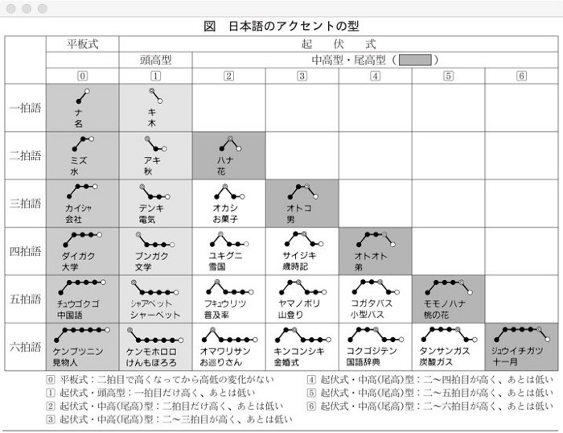

# accents.txt

Pitch data for word/reading pairs.

The file is a plain-text files with one entry per line. Each line contains a
tab-separated list of values with the following fields:

- Word: the main entry. This is usually the kanji form for the word, except
  for words that only have a kana reading.
- Read: the hiragana reading for the word. For kana-only words this is empty.
- Pitch: comma-separated list of integers representing the pitch position.
	- 0: all except the first mora are high.
	- 1: all except the first mora are low.
	- N: the first mora is low, all mora up to N are high, N is low.

For a reference on the pitch position see https://tejashdatta.medium.com/what-is-pitch-accent-in-japanese-and-is-it-important-ce1e60c65db3:

Reference for the Yomichan algorithm:
- https://github.com/FooSoft/yomichan/blob/be23acf499bcdb530c1b8990aa3d6211323cbdb2/ext/js/display/display-generator.js#L631

Source:
	- Project: https://github.com/mifunetoshiro/kanjium
	- https://raw.githubusercontent.com/mifunetoshiro/kanjium/master/data/source_files/raw/accents.txt
